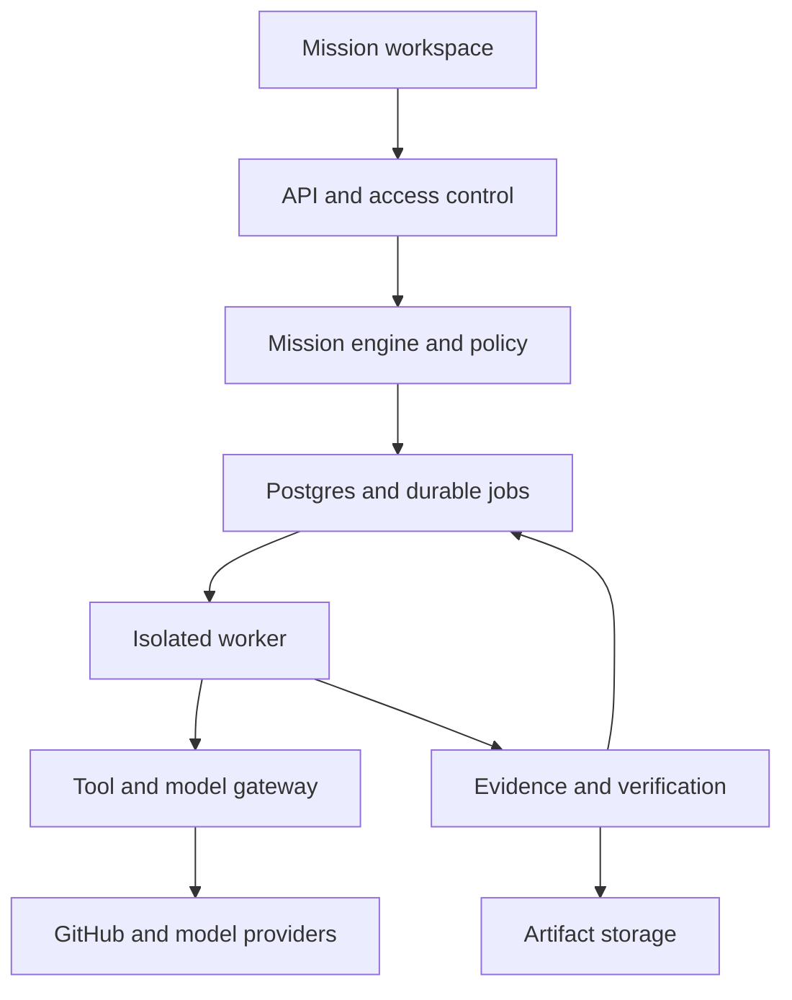

# Architecture

Status: proposed design, not implemented. This document extends [VISION.md](VISION.md).
The repository currently contains product documentation, not a working platform.

## Product contract

A mission is a versioned agreement about an outcome: scope, acceptance criteria,
allowed resources, budget, deadline, approvers, and deliverables. Conversation
helps define it; the mission record governs execution.

Initial customer hypothesis: small software teams and agencies using GitHub.
Initial mission: turn a bounded repository issue into a tested, reviewable pull
request. Completion means the agreed delivery was accepted; a PR is not evidence
of a production fix unless deployment and production verification were in scope.

The user should see the goal, current step, blocker, next approval, evidence,
spend, and deliverable without reading an agent transcript. Primary surfaces:
Mission Inbox, Mission Detail, Approval Inbox, and Evidence/Delivery view.

## Proposed implementation choices

These are reviewable engineering defaults, not previously agreed requirements.

| Area | Initial choice | Reason |
| --- | --- | --- |
| Web | TypeScript, React, Next.js | One web interface for missions and approvals |
| Control plane | TypeScript modular service | Keep domain rules together initially |
| Persistence | PostgreSQL | Transactions, tenant scope, event history and durable jobs |
| Workers | Separate isolated runner processes | Keep untrusted code outside the API |
| Artifacts | S3-compatible object storage | Immutable content-addressed outputs |
| Model access | Provider adapter with usage accounting | Avoid binding mission semantics to one model |
| Integration | GitHub first | Complete one valuable delivery loop |

Do not introduce microservices, a graph database, or a dedicated vector database
before workload measurements justify them. Full-text retrieval is sufficient
for the first memory implementation. Add semantic retrieval only against an
evaluation set. Pin dependency versions when scaffolding the implementation.

## Component boundaries

The mission engine owns transitions, plan versions, dependencies, budgets,
approval validity and completion. Agents propose actions; they do not directly
write authoritative mission state. The gateway enforces capabilities for every
call, including calls originating from plugins or retrieved instructions.

## Domain records

Every tenant-owned record carries workspace_id. Composite references and
database access policies prevent references across workspaces.

| Record | Required information |
| --- | --- |
| Mission | owner, goal, scope, acceptance criteria, state, version, budget, deadline |
| PlanVersion | mission, revision, task dependency graph, estimate, approver |
| Task | plan version, dependencies, assignee role, output contract, state |
| Run | task, attempt, model/prompt versions, lease, input snapshot, usage |
| ToolAction | run, operation, target, payload digest, policy decision, external receipt |
| Approval | authorized approver, exact action/plan digest, expiry, decision |
| Artifact | mission, immutable digest, storage reference, producing run |
| Evidence | criterion, artifact/source version, verifier, result, timestamp |
| MissionEvent | sequence, actor, transition, correlation ID, timestamp |
| MemoryRecord | provenance, scope, validity and lifecycle from MEMORY_SYSTEM.md |

Store state changes and an outbox/job entry in the same transaction. Workers
claim jobs with leases and fencing tokens; expired workers cannot commit new
state. Optimistic versions reject concurrent stale transitions.

## Lifecycle and invariants

| Current state | Event and guard | Next state |
| --- | --- | --- |
| draft | Required contract fields supplied | planning |
| planning | Valid acyclic plan persisted | awaiting_plan_approval |
| awaiting_plan_approval | Authorized approval of current plan | ready |
| ready | Dependencies, budget and permissions valid | running |
| running | External action requires approval | awaiting_action_approval |
| awaiting_action_approval | Exact action approved and revalidated | running |
| running | Missing input, outage, or budget/deadline limit | blocked |
| blocked | Blocker resolved; any changed plan approved | ready |
| running | Required outputs collected | verifying |
| verifying | Evidence fails; bounded repair allowed | running |
| verifying | Criteria pass against current artifact versions | awaiting_acceptance |
| awaiting_acceptance | Owner accepts evidence and delivery | completed |

An authorized owner can cancel any nonterminal mission. An unrecoverable error
or exhausted repair budget moves it to failed. Rejected approvals block work;
rejected delivery returns to planning with reasons. Scope changes create a new
plan version, invalidate affected approvals and evidence, and require approval.
Terminal missions remain historical; further work creates a linked mission.

Task states: pending, ready, running, blocked, verifying, completed, failed,
cancelled. All required tasks and criteria must pass before acceptance.
An agent's success message can never mark a mission completed.

## Durable execution and external effects

Use at-least-once job delivery; do not promise exactly-once remote effects.
Deduplicate webhook deliveries and actions with workspace-scoped keys. Before
an external write, persist an action intent and its stable operation key.
Persist the external receipt after success. If a timeout leaves the result
unknown, reconcile with the remote service before retrying; block for review
if the result cannot be determined. Do not blindly create a second PR.

Only retry classified transient failures with bounded backoff. Authentication
failure, permission denial and rejected approval are blockers. Persist task
outputs so restart resumes unfinished work rather than regenerating everything.
Cancellation revokes leases and stops dispatch; already completed external
actions remain recorded and require explicit compensating actions.

## Trust boundaries

Authenticate people separately from agents. Scope tokens to workspace, repo,
mission, operation and expiry. Keep credentials in the gateway; model contexts
and runner logs must not contain secrets. Recheck permissions immediately before
execution, even after approval.

Run repository code in disposable isolation without host mounts or gateway
credentials, with resource limits and restricted network access. Tool results,
issues, repository instructions and memory are untrusted data and cannot grant
new authority. Approval binds to action digest, repo, branch and commit SHA;
changing any bound input invalidates it. Default pilot policy requires approval
for remote writes; merge, deployment and destructive operations are outside MVP.

Reserve estimated spend before dispatch; reconcile actual usage after calls.
Parallel runs share one atomic mission budget. Bound output tokens, wall time,
tool calls and repair attempts. Stop new work when the budget is exhausted;
display pending usage rather than claiming perfectly instantaneous billing.

## Operations and first acceptance tests

Track time to accepted delivery, human handling time, cost per accepted mission,
verification failures, approval latency, retries and permission denials.
Trace mission -> task -> run -> action -> evidence with redacted structured logs.

Before a pilot, demonstrate: restart mid-task; duplicate webhook; remote success
followed by timeout; stale approval after a new commit; concurrent budget
reservations; attempted cross-workspace retrieval; cancellation during a run;
failing test preventing completion. Back up Postgres and artifacts and exercise
a restore. Audit history is append-only at application level, not a claim of
cryptographic tamper-proof storage.

See [AGENT_MODEL.md](AGENT_MODEL.md), [MEMORY_SYSTEM.md](MEMORY_SYSTEM.md)
and [ROADMAP.md](ROADMAP.md) for contracts and delivery gates.
